# Data Science / Machine Learning as Script

## 6/29: Kedro紹介 @ TDSE Night

<br><br>

## Noriaki Watanabe

<br>

#### version: 0.1.2

---

# Agenda

1. 背景
1. ワークフローエンジンについて
1. Kedroについて
1. Kedroの基本概念
1. Kedroの使い方
1. Kedroのその他機能について補足

---

# はじめに

## この発表の目的について

<br>

#### ワークフローツールについて馴染みがない人

* ワークフローツールの存在を認知してもらう
* Kedroの存在を頭の片隅に置いてもらう

#### ワークフローツールを導入したいと思っている人

* ワークフローツールを実務等で導入するきっかけを得る
* Kedroに興味を持ってもらう/試しに使ってもらう
  + ただしKedroを強く推奨するものではない

#### (Kedro以外の)ワークフローツールを既に使っている人

* ワークフローツールに様々なものが存在する事を改めて認識してもらう
* Kedroに興味を持ってもらう/試しに使ってもらう

#### Kedroチョットデキル人

* 発表者にいろいろ教えてください


---

# 背景

データ分析・モデリングにおいて、スクリプトにまつわる様々な課題あるいは要求が山積している。

<div class="grid grid-cols-[33%,33%,34%] gap-4"><div>

<u>開発品質上の要求</u>

* 再現性の担保
* バージョン管理
* 非属人的

...

</div><div>

<u>開発効率上の要求</u>

* 再利用可能性
* 疎結合
* 実験管理

...

</div><div>

<u>運用・保守上の要求</u>

* スケーラビリティ
* ソフトウェアテスト
* エラー・障害対応

...

</div></div>


最近流行りのMLOpsはこれらの一部を解決するが、
ある程度の品質のスクリプトを準備した上での課題に注力しており、
実際の問題はより基本的なレベルである事も多い。

とりわけ今回は、ワークフローのスクリプト化、という最も基本的なステップの実現について簡単に見ていきたい。

なお本発表で用いている
Data Science as Script (DSaS) / Machine Learning as Script (MLaS)
という標語（注：発表者の造語）は、そもそものデータ分析やモデリングを、
きちんと『スクリプト』（従来より広い意味）で表現し直すところから出発する事を意味している。

---

# ワークフローツール

* 依存関係のあるタスク群に対して、適切な順番で実行していく一連の流れを、ワークフローという。
  * 多くの自動化処理は、ワークフローを用いて自然に表現される。
* 特にワークフローを定義・管理し、実行するツールを、ワークフローエンジンと呼ぶ。

<div class="grid grid-cols-[65%,35%] gap-4"><div>

* 多くのワークフローエンジンにおいて、ワークフローは有向非巡回グラフ(Directed Acyclic Graph, 通称DAG)と呼ばれる形式で表される。
  * 「グラフ」は、ノードの集合と、それらを結ぶエッジから構成される対象。
  * 「有向」は、エッジに向きがある事を意味する。
  * 「非巡回」は、任意のノードに対し、(1つ以上の)矢印の向きに従っていった際に、決して自身へ戻らない（＝有向の意味でループが存在しない）事を意味する

</div><div>

<u>workflow DAGの例</u>

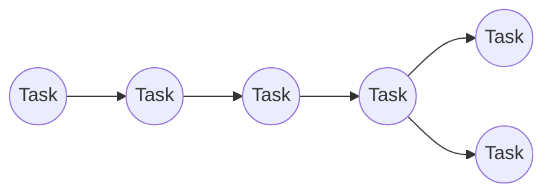

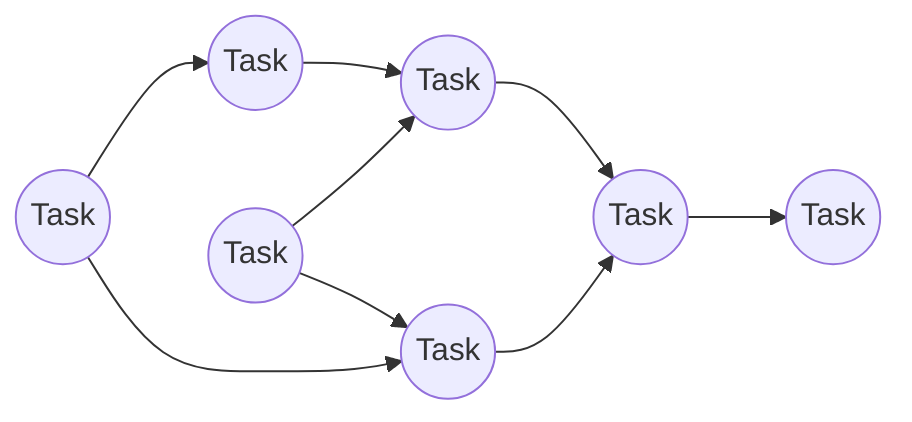

<u>DAGでない例</u>

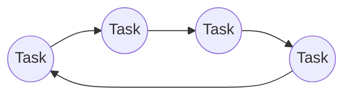

</div></div>

---

# ワークフローエンジンの例（１）

ここでは、Pythonで構築可能あるいは構築したスクリプト資産を活用できるワークフローエンジンを幾つか挙げてみる。

<v-click>

<div style="font-size: 11pt;">

* make：元々はUnix等でビルド作業を自動化するためのツール。タスク単位はコマンド。タイムスタンプベースでワークフローの実行可否を判定。簡単な手順を自動化するのにはお手軽だが、複雑なワークフローを実現するのには向かない。
* Luigi：Spotifyが開発。ワークフローツールの中では、歴史は古い。タスク定義をPythonのクラスで行うが、既存リソースの再利用が難しい。
  * gokart: エムスリーが開発しているLuigiのラッパ。LuigiよりもI/O処理とパイプライン定義に関する利便性が向上。可視化やロギング等のエコシステムも存在。
* metaflow：Netflixが開発。タスク定義はLuigi形式に近く、より機械学習を意識した設計になっている。同じく既存リソースの再利用が難しい。
* Apache Airflow：GUIや分散処理機能はかなり充実している分、導入は面倒。Operator形式で、DAGをPythonスクリプト内で定義できる。各種クラウドサービスにフルマネージドサービス（Cloud ComposerやAmazon Managed Workflows for Apache Airflow）が提供されており、他のワークフローに比べると、スケーラブルな本番運用はしやすいと思われる。
* Prefect：Prefect Technologiesが開発。Pythonベースで、ワークフローを定義。ワークフローの実行スケジューリングや監視はPrefect Cloudを通して行う。

</div>

</v-click>

<!--
  - Luigi や metaflow などのワークフローライブラリでは、フレームワーク固有のタスククラスを再定義する必要がある。
  <style>
.tree code {
  font-size: 5.5pt;
  line-height: 1.22;
  display: block;
}
</style>
-->

---

# ワークフローエンジンの例（２）

<div style="font-size: 11pt;">

* Kedro：QuantumBlack（MckinseyのAI担当組織）が開発。既存のPython資産を流用できる。
入出のデータを、DataCatalogという形式で抽象化できるのが特徴。またデータ分析・モデリングのテンプレートを利用する事を強く推奨（前提）としている。
* dvc：Iterativeが開発。gitのデータ管理版という立ち位置。pythonの実行スクリプト単位でノードを定義し、CLIでパイプラインを構築していく。入出力は、実行引数で陽に与える。
* MLflow：DataBricksが開発。実験管理機能(Tracking)はよく知られているが、ワークフローエンジンとしての機能(Projects)もある。Makefileをyamlファイルベースで記載していくイメージで、小回りは効かない。
* Argo workflows：Applatixが開発。Kubernetesネイティブなワークフローエンジン。ノードをコンテナ単位で実行し、スケーラビリティに優れる。コンテナの入出力は、Artifactという形で保存される。
* Kubeflow：Kubernetes上で動作するワークフロー構築プラットフォーム。Argo workflowと類似しているが、Tensorflow用のパイプラインツールであるTensorflow Extend (TFX)をベースとしているため、よりMLOpsに特化していると言われる。またSDKライブラリは、Vertex AI pipelineでも採用されている。
* Cloud workflows：GCPで(流行りの)microserviceを実現するサービス。サーバレスなHTTP APIをノードの単位とする。
* AWS Step Functions：AWS Lambdaをノード単位とする分散アプリケーション構築サービス。

</div>

他にも多数のワークフローエンジンがこの世には存在する。

※ 例えば https://github.com/meirwah/awesome-workflow-engines 参照

---

# c.f. workflow vs pipeline

この2つの違い分かりますか？

<v-click>

多くの場面で、これらを区別せずに同義語として用いられている。実際にこれらの違いを調べてみても、意外に引っかからず、また回答内容が人によってやや異なる。
本発表（個人的な定義）では、世間的な定義を参考にしつつ、以下の定義を採用する。

※ 例えばhttps://www.biostars.org/p/17696/ を参考にした

* ワークフロー：依存関係のあるタスク群に対して、適切な順番で実行していく一連の流れ（再掲）
  + 必ずしも機械的に実行するものではなく、人間がこなす業務の事も指し示す。そのため、そのタスク単位も、業務に沿ったものが自然になりやすい。
* パイプライン：データの入出力を考慮したワークフロー。データが主体で、タスクによって変換されていく。
  + ワークフローエンジンの表現形式としては、データノードとタスクノードからなる（二部）DAG形式として持つのが一般的と思われる。
  + タスク単位としては、保持したいデータ単位で区切っていくのが自然である。
  + また自動化された実行を前提とする。

</v-click>

---

# 今回見ていくワークフローエンジン

先に列挙したワークフローエンジンのうち、今回は
Kedro
について紹介する。

<!-- 前ページをコピペしてハイライト -->

<u>取り上げたざっくり理由</u>


<div style="font-size:16px;">

* 導入が容易
  + `pip install kedro` (PyPI経由)や`conda install -c conda-forge kedro` (Conda経由)で入る
* 既存のPython資産を転用しやすい
  + ただしKedroを便利に活用するためには、プロジェクトテンプレートの導入が必要不可欠である。これは既存のプロジェクトに影響を及ぼしうるので注意が必要である。
* 他ワークフローエンジンとの互換性が高い
  + 開発マシン・スモールな本番環境上では、Kedroで実行を行い、スケーラビリティを要求される場面で、クラウド・k8sネイティブなワークフローエンジンに移行するのが、一つのパスであると考えられる
* DataCalalogによるデータセット抽象化が便利

</div>

<p style="font-size:14px;">
ただし、実はAirflowやKubeflow、Prefectなど人気のワークフローエンジンの基本的な利用方法は、Kedroと大きく変わらない。
いずれもPython関数をノード化し、パイプラインも、その関係性をPythonで定義する事で実現。
データの入出力もある程度抽象化されている。よって、Kedroに慣れれば、幾つかのツールへの移行は比較的スムーズに行える（はず）。
</p>

<p style="font-size:12px;">
※ 個人的な追加の選定理由。現時点でドキュメント・APIの分量がちょうどよく、少し頑張れば、一通り目を通せるレベル。ソースコードも必要な機能を調べる分には十分追える。
</p>

---

# Kedro: nice workflow framework for "Data Science as Script"

<div class="grid grid-cols-[65%,35%] gap-4"><div>

* QuantumBlack社が開発
* Linux Foundation Projectに参画
* ライセンスはApache 2.0
* 2022年6月末時点でバージョンは0.18.1、スター数は7.3K
  * https://kedro.readthedocs.io/en/stable/index.html
* Kedroが目指す方向性
  - Reproducible：再現的な分析
  - Maintainable：持続的・継続的な分析
  - Modularity：効果的なモジュール化に伴う再利用可能
* 理念については、The Principles of Kedro を参照
  - https://github.com/kedro-org/kedro/discussions/824

</div><div>

<div style="display: flex;justify-content: center;">
ロゴ
</div>


</div></div>

<p style="font-size:14px;">
※ 語源は、中核(core. center)を意味するギリシャ語から取った、とMckinseyのWebページに記載があるが、実際に検索してみると、古代ギリシャ語 κέδρος あたり（意味は、cedar/杉）しか引っかからない。
</p>

---

# Kedro の特徴

- DAG 形式のワークフローをPythonだけで構築可能
  - 関連パッケージであるkedro-vizで可視化も可能
  - タスク部分は従来の Python スクリプトをそのまま転用可能
- データの入出力や依存パラメータを抽象化
  - データやパラメータを yaml ファイルで一元管理する事で実現
    - パス（ファイルの在り処）とコードを切り離す
    - データの形式も設定ファイル側に記載
- Cookiecutter を利用したディレクトリ構造のテンプレート化
- 他のワークフローエンジンへのデプロイサポート
  - Apache Airflow, Prefect, Kubeflow, Argo workflows, Databricks, AWS Batch, AWS Step Functions ...

<!--
    データが扱いやすい
        データ・中間オブジェクトの管理が可能
        データのキャッシュ機能を活用できる
    Jupyter Notebook, Jupyter Labとのインテグレーションが整っている

derives from the Greek word meaning center or core, signifies that this open-source software provides crucial code for ‘productionizing’ advanced analytics projects
-->

---

# 4 Basic Concepts in Kedro

以下の概念さえ抑えれば、Kedro の主要な機能は把握したと言える。

- Node：DAGのノードで、タスクを表す。DataCatalogに隣接。
- Pipeline：（二部）有向非巡回グラフ（DAG）（の部分グラフ）で、データの入出力を定義したワークフローを表す。
  - Modular pipeline：再利用される事を前提としたPipeline。
- DataCalalog：DAGのノードで、データやパラメータを表す。Nodeに隣接。
  - Config：データやパラメータの定義・メタ情報を記載した設定ファイル。
- Runner：定義されたDAGに基づいて、実行をスケジューリングする。

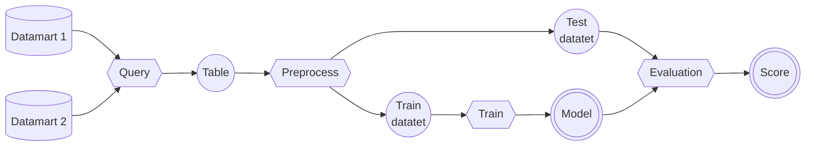

<!--
# Workflow vs pipeline graph vs Kedro concepts

ここでは、

- Node: 基本タスクとその入出力情報に対応。文字通りグラフのノード
- Pipeline: タスクの接続関係を定義。
-->

---
layout: two-cols
---

::default::

# Node

#### どういうものか？
Python の関数を、kedroのnode関数でラップしたもの（Nodeクラス）。

#### どういう役割か？
最小タスクの単位。機械学習の文脈では、前処理とか学習とかがその典型例。

#### 何が素晴らしいか？
- 分析等で使った関数がそのまま転用できる。
  - 例えば、モジュールの main 関数。
  - Node部分はフレームワーク依存なので、他のフレームワークとの互換性が高くなる。

::right::

<br><br><br>

<v-click>

#### 必要な情報は何か？
- 入力元（依存データ）
- 出力先（結果、中間生成物）
- 変換関数（通常の Python 関数）

<br>

#### 実装パターン
```python
from kedro.pipeline import node

def my_python_func(input):
    ...  # some processing
    return output

my_node = node(
    func=my_python_func,
    inputs="my_input",
    outputs="my_output",
    name="my node",  # Optional
    tags="test",  # Optional
)
```

</v-click>

---
layout: two-cols
---

::default::

# Pipeline

#### どういうものか？
Nodeクラスを集めて、kedroのpipeline関数でラップしたもの（Pipelineクラス）。

#### どういう役割か？
一連のタスクを組み合わせた実行単位。
複数のpipelineやnodeを組み合わせて新たなpipelineも構築可能。
ノードの入出力依存関係から処理順序が決まる。

#### 何が素晴らしいか？
- パイプラインの中でパイプラインを階層的に呼び出せる。
- パイプラインの合併演算（＝Node集合の和集合を取る）が定義されている。
- パイプラインを登録しておくことで、容易にテストが行える。(`kedro run`コマンド)

::right::

<br><br><br>

<v-click>

#### 必要な情報は何か？
- 取り込むべきNodeの一覧
- 入力元（依存データ）
- 出力先（最終成果物）
- パラメータ

<br>

#### 実装パターン

```python
from kedro.pipeline import pipeline
from .nodes import my_node1, my_node2, my_node3
# Each node can be defined in other module
my_pipeline = pipeline(
    pipe=[my_node1, my_node2, my_node3],
    inputs=["my_input1", "my_inputs2"],  # Optional
    outputs="final_output",  # Optional
    parameters="my_parameter",  # Optional
    namespace="data_processing",  # Optional
    tags="test",  # Optional
)
```

</v-click>

---
layout: two-cols
---

::default::

# Data Catalog

#### どういうものか？
データセット名と、そのファイルパスやデータセット情報などのメタ情報を予め定義したもの。
yamlファイルで記述される。

#### どういう役割か？
NodeやPipelineの入出力を、実際のパスやデータの種別などと紐付ける。
ファイルに読み書きする必要は必ずしもなく、メモリ上に保持する事も可能。（MemoryDataset）

#### 何が素晴らしいか？
- 定義されたデータセット名を指定するだけで、読み書きが行える。
- データセットを一元管理管理。
- fsspecを利用する事で、S3やGCSなど外部ストレージや、Web APIなども利用可能。

::right::

<br><br>

<v-click>

#### 必要な情報は何か？

- 事前定義された型
- ファイルパス（外部ストレージやURLも可）
- 読み書き時の引数、バージョン管理フラグなど

#### 実装パターン

<u>設定ファイル</u>

```yaml
input_data:
  type: pandas.ExcelDataSet
  filepath: gcs://my_bucket/dataset.xlsx
  credentials: my_gcp_credentials
  load_args:
    sheet_name: my_data
model:
  type: pickle.PickleDataSet
  filepath: data/06_models/model.pkl
  versioned: true
```

<u>Pythonスクリプト</u>

```python
from kedro.io import DataCatalog, MemoryDataSet
# The dataset also can be saved as in-memory.
data_catalog = DataCatalog({"temporal": MemoryDataSet()})
```

</v-click>

---
layout: two-cols
---

::default::

# Runner

#### 何を指すか？
DataCatalogを参照し、定義したPipelineを実際に実行する。
Runnerの出力は、Pipelineの出力に一致する。

#### どういう役割か？
定義したパイプラインを実行する。
実行順序は、DAG構造を考慮してRunnerが決定する。

#### 何が素晴らしいか？
- CLIからも実行可能（後述）
- 現在 SequentialRunner, ParallelRunner, ThreadRunner の3つがある。
  - SequentialRunner: 順番に逐次実行
  - ParallelRunner: プロセス並列に実行
  - ThreadRunner: スレッド並列に実行

::right::

<br><br><br>

<v-click>

#### 必要な情報は何か？

- 実行方法とそのユースケース
  - Sequential: 分岐が少ない、1タスクの消費リソースが大きい場合
  - Parallel: 互いに独立したNodeが多い場合
  - Thread: Sparkを使用する場合

#### 実装パターン

<u>CLI</u>

`kedro run --pipeline=<pipeline name> --runner=<runner type>`
で実行可能。

<u>Pythonスクリプト</u>

```python
runner = SequentialRunner()
output = runner.run(my_pipeline, data_catalog)
```

</v-click>

---

# Toy example

これまではKedroで重要な4つの概念を見てきた。
次に、これらが実際にどう組み合わされて、
どういう手順で1つのワークフローに組み上がっていくか、
について、具体的なおもちゃの例に沿って見ていく。

<v-click>

<div class="grid grid-cols-[75%,25%] gap-4"><div>

#### 設定・要件

* データセットとして、商品毎の価格と購買数がまとまったCSVファイル（右）がある。
* 最終結果としては、消費税を考慮した総額を計算したい。
  * 消費税はパラメータとして与える。
* ただし消費税込みの金額を中間テーブルとして出力する。

</div><div>

<u>今回使うCSVファイル</u>

```csv
item,price,quantity
orange,40,7
grape,230,3
apple,90,9
melon,700,2
dorian,2100,3
```

</div></div>

</v-click>

<v-click>

<div class="grid grid-cols-[75%,25%] gap-4"><div>

#### 補足

これまでに述べたKedroの機能をフルに使うためには、通常、Kedro環境をセットアップする必要がある。
具体的にはCLIから
**kedro new**
で必要な情報を入力を行う事で、プロジェクトテンプレート（右）が生成される。
しかし、今回はこれを用いない例を作成したので、紹介する。

</div><div class="tree">

```txt
├── README.md, pyproject.toml, setup.cfg
├── conf
│   ├── base
│   │   ├── catalog.yml
│   │   ├── logging.yml
│   │   └── parameters.yml
│   └── local
│       └── credentials.yml
├── data
│   ├── 01_raw/
│   │     :
│   └── 08_reporting/
├── docs
│   └── ... (omitted)
├── logs
│   └── ... (omitted)
├── notebooks/
└── src
     ├── requirements.txt, setup.py
     ├── tests/
     │   └── ... (omitted)
     └── <my package>
         └── omitted

※一部省略
```

</div></div>

</v-click>

<style>
.tree code {
  font-size: 5.5pt;
  line-height: 1.22;
  display: block;
}
</style>

---

# Step0. Image Workflow

ワークフローイメージを以下に描く。

<v-click>

1. 購入履歴ファイル(purchase_history)を読み込み、税率(tax_rate)を与えて、税込みの金額を算出

</v-click><v-click>

2. 算出した金額を税込みファイル(with_tax)に書き出す

</v-click><v-click>

3. 税込みファイル(with_tax)を読み込み、合計金額を計算する

</v-click><v-click>

4. 算出した合計金額を(文字列として)結果ファイル(total_amount)に書き出す

</v-click>

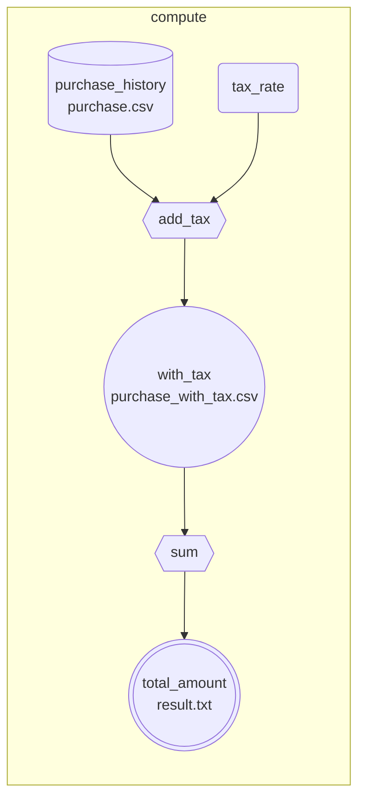

---

# Step1. Create DataCatalog Configurations

データセット定義設定ファイルとパラメータ定義設定ファイルをそれぞれ作成する。実際のプロジェクトでは、随時更新を行っていくが、今回は全て最初に設定する。

<div class="grid grid-cols-[60%,40%] gap-4"><div class="tree">

#### Dataset

**conf/base/catalog.yml** として保存

```yaml
purchase_history:  # 購入履歴ファイル
  type: pandas.CSVDataSet
  filepath: data/purchase.csv
  load_args:
    index_col: item

with_tax:  # 税込金額ファイル
  type: pandas.CSVDataSet
  filepath: data/purchase_with_tax.csv
  load_args:
    index_col: item
  save_args:
    index: True

total_amount:  # 合計金額
  type: text.TextDataSet
  filepath: data/result.txt
```

</div><div>

#### Parameters

パラメータは消費税率のみ。

**conf/base/parameters.yml** として保存

```yaml
tax_rate: 0.1
```

</div></div>

<style>
.tree code {
  font-size: 9pt;
  line-height: 1.3;
  display: block;
}
</style>

---

# Step2. Define Python functions free from Kedro

以下の、Kedroに依存しない、通常のPython関数を定義する。

* 税込金額の計算：`include_tax`関数
* 合計金額の計算：`sum_all_payment_amount`関数

<div class="tree">

**calc.py**として保存する

```python
from typing import Union
import pandas as pd

def validate_dataframe(df: pd.DataFrame, col_name: str, types: Union[type, tuple[type]]):
    if col_name not in df.columns:
        raise AssertionError(f"`{col_name}` column should be included.")
    if not df[col_name].apply(lambda x: isinstance(x, types)).all():
        raise AssertionError(f"All elements in the {col_name} column should be of {types}.")

def include_tax(df_purchase: pd.DataFrame, tax_rate: float = 0.1) -> pd.Series:
    # tax means sales tax or VAT here
    validate_dataframe(df=df_purchase, col_name="price", types=(int, float))
    validate_dataframe(df=df_purchase, col_name="quantity", types=int)
    # calculate the total amount including tax
    df_amount = df_purchase["price"] * df_purchase["quantity"] * (1. + tax_rate)
    return df_amount.rename("amount")

def sum_all_payment_amount(df_amount: pd.DataFrame) -> str:
    validate_dataframe(df=df_amount, col_name="amount", types=(int, float))
    return str(int(df_amount.sum()))
```

</div>

<style>
.tree code {
  font-size: 7.5pt;
  line-height: 1.3;
  display: block;
}
</style>

---

# Step3. Define Kedro Nodes with the defined functions

先のステップで定義したPython関数を、KedroのNodeへと変換する。

* 税込金額の計算タスク：`add_tax` Node
* 合計金額の計算タスク：`sum` Node

<div class="grid grid-cols-[50%,50%] gap-4"><div class="tree">

**nodes.py**として保存する

```python
from kedro.pipeline import node

from calc import include_tax, sum_all_payment_amount

tax_adding_node = node(
    func=include_tax,
    inputs=["purchase_history", "params:tax_rate"],
    outputs="with_tax",
    name="add_tax",
)
summation_node = node(
    func=sum_all_payment_amount,
    inputs="with_tax",
    outputs="total_amount",
    name="sum",
)
```

</div><div class="center">

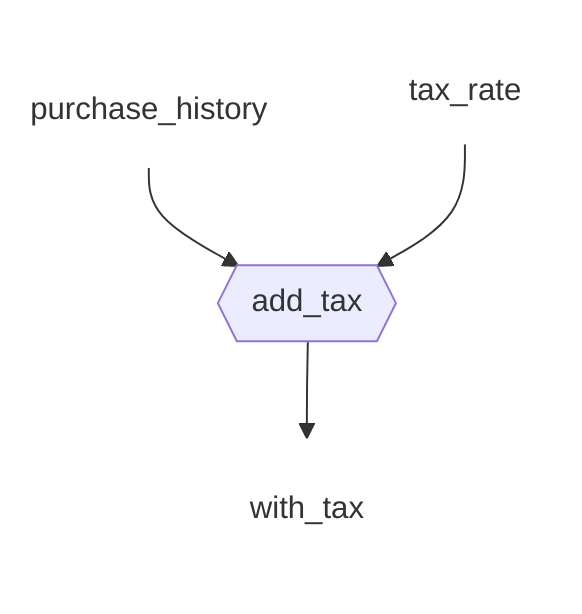

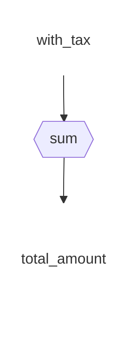

</div></div>

<style>
.center {
  display: flex;
  justify-content: center;
}

.tree code {
  font-size: 7.5pt;
  line-height: 1.3;
  display: block;
}
</style>

---

# Step4. Define a Kedro Pipeline with the defined Nodes

次に、Nodeを集めてきて、KedroのPipelineを定義する。

<div class="grid grid-cols-[50%,50%] gap-4"><div class="tree">

**pipelines.py**として保存する

```python
from kedro.pipeline import pipeline

from nodes import tax_adding_node, summation_node

price_calculation_pipeline = pipeline(
    pipe=[tax_adding_node, summation_node],
    inputs="purchase_history",
    outputs="total_amount",
    parameters="params:tax_rate",
    tags="compute",
)
```

</div><div class="center">

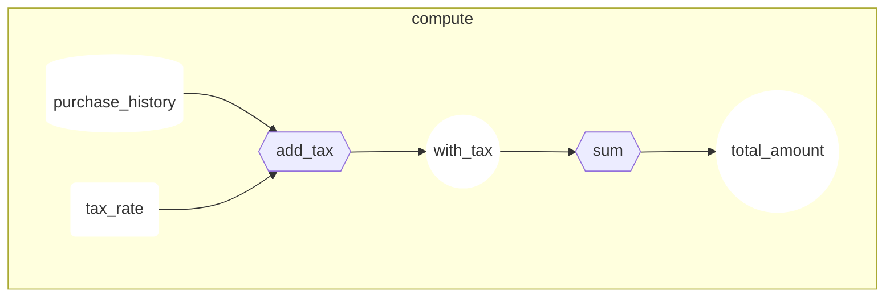

</div></div>

<style>
.center {
  display: flex;
  justify-content: center;
}

.tree code {
  font-size: 7.5pt;
  line-height: 1.3;
  display: block;
}
</style>

---

# Step5. Setup DataCatalog

フローは完成したので、後は流すデータの情報を記述するために、DataCatalogをセットアップする。

<div class="grid grid-cols-[60%,40%] gap-4"><div class="tree">

**catalog.py**として保存する

```python
from typing import Any

from kedro.io import DataCatalog
from kedro.config import ConfigLoader

def load_catalog() -> DataCatalog:
    conf_loader = ConfigLoader(conf_source="./conf", env="base")
    conf_catalog: dict[str, dict[str, Any]] = conf_loader.get("catalog.yml")
    conf_params: dict[str, Any] = conf_loader.get("parameters.yml")
    conf_params_replaced: dict[str, Any] = {
        f"params:{name}": params for name, params in conf_params.items()
    }
    catalog = DataCatalog.from_config(conf_catalog)
    catalog.add_feed_dict({
        "parameters": conf_params,
        **conf_params_replaced,
    })
    return catalog
```

</div><div class="center">

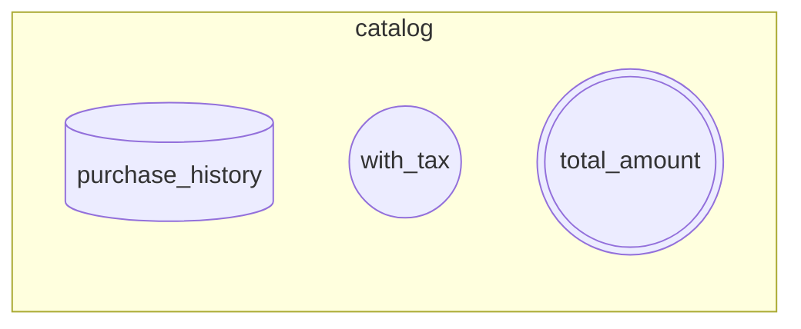

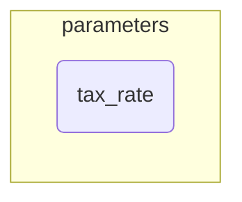

</div></div>

※ 今回は `load_catalog` 関数を陽に定義したが、実際は、プロジェクトテンプレートに従う事で、このステップはKedro内部で陰に行われる。（後述）

<style>
.center {
  display: flex;
  justify-content: center;
}

.tree code {
  font-size: 7.5pt;
  line-height: 1.3;
  display: block;
}
</style>

---

# Step6. Invoke Runner

最後にRunnerを呼び出し、定義したPipelineを起動するスクリプトを用意する。

<div class="grid grid-cols-[50%,50%] gap-4"><div class="tree">

**run.py**として保存する

```python
from typing import Any

from kedro.runner import SequentialRunner

from catalog import load_catalog
from pipelines import price_calculation_pipeline

catalog = load_catalog()

def run() -> Any:
    runner = SequentialRunner()
    return runner.run(price_calculation_pipeline, catalog)

if __name__ == '__main__':
    output = run()
    print(output)
    print(catalog.load("total_amount"))
```

</div><div class="center">

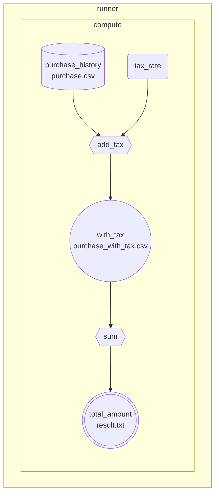

</div></div>

<style>
.center {
  display: flex;
  justify-content: center;
}

.tree code {
  font-size: 7.5pt;
  line-height: 1.3;
  display: block;
}
</style>

後は、
`python run.py`
を走らせると、
`data/result.txt`
に出力結果がはかれる。

---

# 参考：プロジェクトテンプレートを使用した実行

実際のプロジェクトでは、DataCatalogのセットアップと、Runnerの実行スクリプトは不要である。

<u>移行手順</u>

1. NodeとPipeline定義スクリプトを `data/<package>/pipelines/` 以下に置く。
1. `data/<package>/pipeline_registry.py` 内で、生成したパイプラインを `register_pipelines` 関数内で登録。
1. `kedro run ...` で登録したパイプラインが実行可能。

<div class="grid grid-cols-[50%,50%] gap-4"><div class="scripts">

`data/<package>/pipeline_registry.py`

```python
from typing import Dict
from kedro.pipeline import Pipeline
from toys.pipelines.my_pipelines import create_pipeline

def register_pipelines() -> Dict[str, Pipeline]:
    return {"__default__": create_pipeline()}
```

</div><div class="scripts">

`data/<package>/pipelines/my_pipelines.py`

<p style="font-size:7.5pt;">
※ `my_pipelines.py` は任意のファイル名、また任意の階層構造に置き換えて良い。
</p>

```python
from kedro.pipeline import pipeline, Pipeline
from .nodes import tax_adding_node, summation_node

def create_pipeline() -> Pipeline:
    price_calculation_pipeline = pipeline(
        pipe=[tax_adding_node, summation_node],
        inputs="purchase_history",
        outputs="total_amount",
        parameters="params:tax_rate",
        tags="compute",
    )
    return price_calculation_pipeline
```

</div></div>

<style>
.scripts code {
  font-size: 7.5pt;
  line-height: 1.3;
  display: block;
}
</style>

---

# Pipeline Visualization

`kedro viz`コマンドを使う事により、構築したパイプラインの可視化が可能。

<div style="display: flex;justify-content: center;">

Webサーバが立ち上がり、対象URLにアクセスすると、以下のような画面が表示される。

</div>

<div style="display: flex;justify-content: center;">


</div>

<!--


text-align: center;
.center {
  display: flex;
  justify-content: center;
}
-->

---

# Node extraction from Jupyter notebooks

Jupyter Notebookの統合機能の1つとして、Jupyter Notebookから必要箇所をスクリプトとして抽出も可能。

<div>

1. 抽出対象のセルに、"node"タグを付与
1. コマンド `kedro jupyter convert <jupyter notebook file>`

</div>

<div style="display: flex;justify-content: center;">


<p style="font-size:100px;">→</p>


</div>

---

# Pipelines Conversion or Integration

Kedroのワークフローを、他のワークフローエンジンで動作させたり、機械学習環境で実行する方法について、ドキュメント内で紹介されている。

#### Kubeflow Pipelinesの場合

* KedroのNodeは、Kubeflow Pipelinesのコンテナへと変換される
  * 半自動的に変換するスクリプトが示されている
  * Kedro-Dockerというプラグインもある (Docker環境下でのコンテナビルドとKedroプロジェクトの起動を担う)

#### AWS SageMakerの場合

* 各タスク内で、SageMakerのモデル構築・推論機能を呼び出す事が可能
* データセットは全てS3に保持する

#### 注意点

* 基本的には、Node間のデータのやり取りを、メモリに保持して行う事はできない


---

<!--
# Universal definition

類似の workflow ツールは

- kubeflow
  - vertex ai pipeline
  - node 単位でコンテナ化
    - context が共有しづらい
  - デバッグがし辛い
- airflow

- metaflow
- luigi & gokart

-->

# Summary

* Data Science as Script を実現する第一歩として、ワークフローエンジンは必要不可欠
* ワークフローエンジンは既に数多くのものが出まわっており、それぞれ特徴が異なる
  * とりわけ本発表では、Kedroを紹介した
* Kedroを利用するには、以下4つの概念を抑えれば良い：
  * Node：タスクを定義・Python関数で実現
  * Pipeline：ワークフローを定義・Nodeの集合で実現
  * DataCatalog：データ・パラメータを定義（抽象化）・基本的には設定ファイルに定義を記載する
  * Runner：構築したPipelineを実行する

